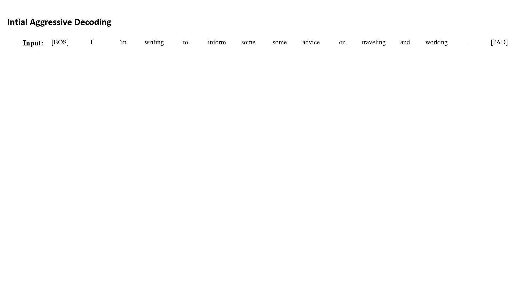

# Shallow-Aggressive-Decoding
Codes for the paper "Instantaneous Grammatical Error Correction with Shallow Aggressive Decoding" (ACL-IJCNLP 2021)


## Installation

```
conda create -n SAD python=3.6
conda activate SAD
conda install pytorch==1.6.0 torchvision==0.7.0 cudatoolkit=10.1 -c pytorch
cd fairseq
pip install --editable .
```

## Usage
This section explains how to decode in different ways.
```
PTPATH=/to/path/checkpoint*.pt # path to model file
BINDIR=/to/path/bin_data # directory containing src and tgt dictionaries  
INPPATH=/to/path/conll*.bpe.txt # path to eval file
OUTPATH=/to/path/conll*.out.txt # path to output file
BATCH=xxx
BEAM=xxx
```

## Directly use fairseq's interactive.py to decode:

```
bash interactive.sh $PTPATH $BATCH $BEAM $INPPATH $BINDIR $OUTPATH
```

## Simplified greedy decoding:

```
python inference.py --checkpoint-path $PTPATH --bin-data $BINDIR --input-path $INPPATH --output-path $OUTPATH --baseline 
```

## Aggressive decoding:

```
python inference.py --checkpoint-path $PTPATH --bin-data $BINDIR --input-path $INPPATH --output-path $OUTPATH --aggressive 
```
